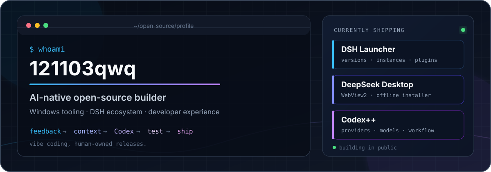

<p align="center">
  
</p>

<p align="center">
  <a href="https://github.com/121103qwq/DSH-Launcher"><strong>DSH Launcher</strong></a>
  ·
  <a href="https://github.com/121103qwq/deepseek-desktop"><strong>DeepSeek Desktop</strong></a>
  ·
  <a href="https://github.com/121103qwq/dsh-vision-sidecar"><strong>Vision Sidecar</strong></a>
  ·
  <a href="https://github.com/121103qwq/CodexPlusPlus"><strong>Codex++</strong></a>
</p>

## I build AI tooling that has to survive outside the demo

Most of my work lives where **AI coding**, **Windows desktop software**, and the **DeepSeek Harness ecosystem** meet.

I use AI heavily. Users bring real problems; I reproduce them, give Codex the missing context, test what comes back, decide whether it ships, and answer for the result.

> **Codex can do the typing. I own what ships.**

## Currently shipping

<table>
<tr>
<td width="50%" valign="top">
  <a href="https://github.com/121103qwq/DSH-Launcher">
    
  </a>
  <h3><a href="https://github.com/121103qwq/DSH-Launcher">DSH Launcher</a></h3>
  <p>A Windows x64 launcher and ecosystem manager for isolated DSH versions, instances, plugins, skills, providers, and conversations.</p>
  <p>The idea started as “AI Minecraft”: plugins are mods, providers are profiles, and different Harness versions deserve real instance management.</p>
  <p><code>C#</code> <code>.NET 8</code> <code>WPF</code> <code>WebView2</code></p>
</td>
<td width="50%" valign="top">
  <a href="https://github.com/121103qwq/deepseek-desktop">
    
  </a>
  <h3><a href="https://github.com/121103qwq/deepseek-desktop">DeepSeek Desktop</a></h3>
  <p>An unofficial, community-maintained Windows x64 desktop distribution of DeepSeek Harness.</p>
  <p>Embedded WebView2, a per-user offline installer, Chinese localization, updates, uninstall, and a release process built for people who actually install the software.</p>
  <p><code>Windows</code> <code>PowerShell</code> <code>WebView2</code> <code>MIT</code></p>
</td>
</tr>
</table>

## The human API

```text
real users
    ↓ feedback
me / human API
    ↓ reproduce + provide context
Codex
    ↓ implementation
me again
    ↓ test + review + release
real users
```

I do not pretend this is traditional hand-written development. It is **vibe coding with a release owner**: AI helps turn ideas into code; I keep the context, judgment, testing, and responsibility on the human side.

**Vibe coding is welcome. Vibe shipping is not.**

## More things in the same orbit

| Project | What it does |
| --- | --- |
| [dsh-vision-sidecar](https://github.com/121103qwq/dsh-vision-sidecar) | Gives text-only DSH reasoning routes hosted visual perception, then stores the resulting visual evidence durably in the session. |
| [Codex++](https://github.com/121103qwq/CodexPlusPlus) | A personal Codex desktop manager for providers, models, sessions, enhancements, updates, and diagnostics. |
| [deepseek-harness](https://github.com/121103qwq/deepseek-harness) | My upstream fork for integration work, experiments, and compatibility testing around DeepSeek Harness. |

## Working set

`C#` · `.NET 8` · `WPF` · `PowerShell` · `Node.js` · `TypeScript` · `WebView2` · `Windows installers` · `GitHub Actions`

## What I optimize for

- **Real use over polished demos.** Downloads, bug reports, upgrades, uninstall paths, and broken environments all count.
- **Public history over reinvention.** Preserve releases, feedback, and commits instead of hiding the messy path to a working product.
- **AI-assisted, human-owned.** The model may write the patch; the maintainer still owns the consequences.

<p align="center">
  <sub>Still building. Usually with Codex open somewhere.</sub>
</p>
